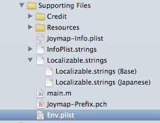
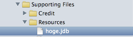

#Joymap

##セットアップ

####1. cocoapodsのインストール (http://cocoapods.org)  

    $ sudo gem install cocoapods -v 0.33.1
    $ pod install

####2. プロジェクトを開く

    $ open Joymap.xcworkspace

####3. Joymap/Env.plist を編集する
  

|Key                    |Valueの説明                |
|:----------------------|:--------------------------|
|User                   |管理画面(joymap.jp/member/)のユーザーID|
|Map                    |地図アプリの名前           |
|GoogleMapsAPIKey       |https://developers.google.com/maps/documentation/ios/start|
|GoogleBrowserAPIKey    |https://developers.google.com/places/documentation/?hl=ja|

####4. JDBファイルを "Supporting Files" にコピーする
  

####5. JDBファイルを "Copy Bundle Resources" に追加する
  

