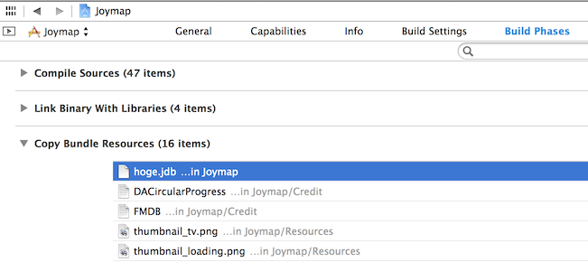

#Joymap

##Setup

####1. setup cocoapods (http://beta.cocoapods.org/?q=)  

    $ sudo gem install cocoapods
    $ pod install

####2. open project  
    $ open Joymap.xcworkspace

####3. edit Joymap/Env.plist
  

|Key                    |Description                |Required|  
|:----------------------|:--------------------------|:------:|  
|ManagerURL             |manager host URL           |Y|  
|DownloadAction         |jdb file will be downloaded from "ManagerURL / DownloadAction" |Y|  
|User                   |login user(e-mail) for manager |Y|  
|Map                    |registered map name        |Y|  
|GoogleMapsAPIKey       |https://developers.google.com/maps/documentation/ios/start  |Y|  
|GoogleBrowserAPIKey    |://developers.google.com/places/documentation/?hl=ja |Y|  

####4. put jdb file into "Supporting Files"  
  

####5. add jdb file into "Copy Bundle Resources"
  

